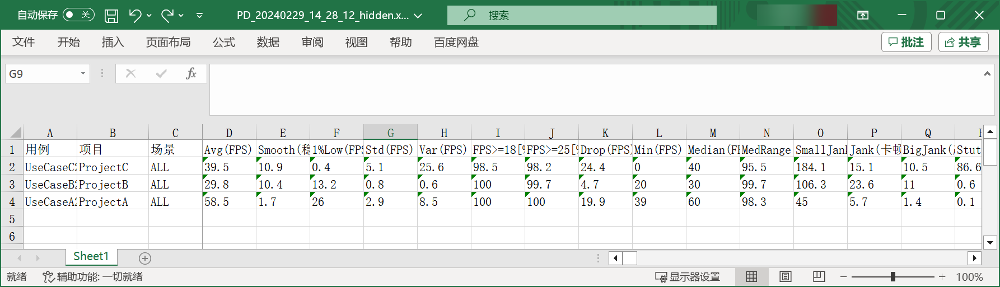
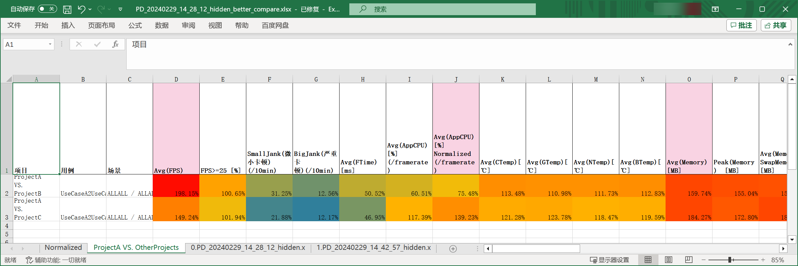
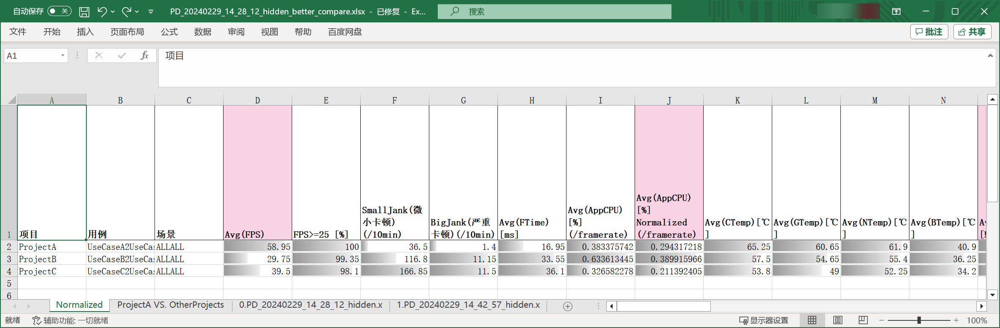

# Perfdog Better Compare

This gives you the better compare look-and-feel, when comparing multiple projects' [PerfDog](https://perfdog.qq.com/) performance.

## What does this do

Let's say, you are comparing 3 projects in PerfDog. After exporting the compare result,


Perfdog genertes this raw excel,


And this python script improves it by,

1. show the compare percentage heat map of TargetProject VS. OtherProjects,
   
2. show the compare percentage bar among all projects
   
3. support normalized by the framerate and resolution among different projects.

## Usage

```bash
usage: perfdog_export_better_compare.py 
    [-h] # show this help
    --input_data_list INPUT_DATA_LIST [INPUT_DATA_LIST ...] # required, input at least one (or multiple) perfdog exported xls. multiple xls's stats will be averaged for each project.
    --input_perfdog_config INPUT_PERFDOG_CONFIG # required, input this perfdog_export_better_compare_config.json
    [--output_xlsx OUTPUT_XLSX] # output file path
    [--target_project_name TARGET_PROJECT_NAME] # optional, input one target project name in "项目" column, and generate the "Target Project VS. OtherProjects sheet
    [--show_only_columns_in_config SHOW_ONLY_COLUMNS_IN_CONFIG] # true by default, only output the important columns list in the config json
    [--specify_resolution] # false by default, whether normalized some columns by the resolution
```

#### Example
```bash
python './perfdog_export_better_compare.py' --input_data_list ./PD_20240229_14_28_12.xlsx ./PD_20240229_14_42_57.xlsx --input_perfdog_config ./perfdog_export_better_compare_config.json --target_project_name ProjectA
```

