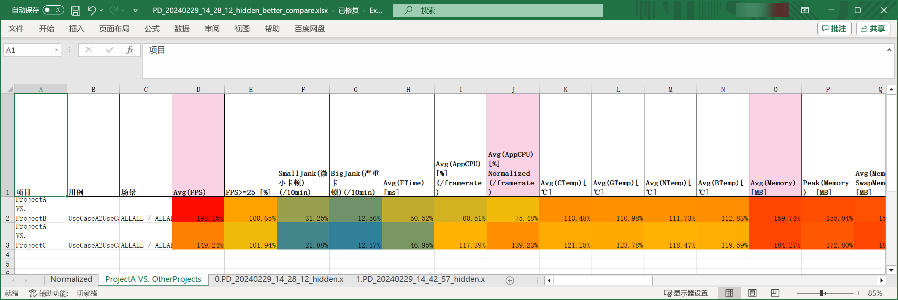
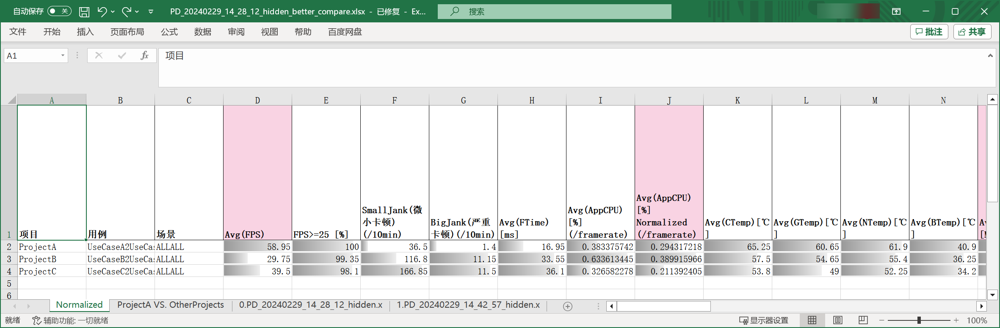

# Perfdog Better Compare

This gives you a better compare look-and-feel, when comparing multiple test cases' [PerfDog](https://perfdog.qq.com/) performance.

## What does this do

Let's say, you are comparing 3 projects (or test cases) in PerfDog. After exporting the compare result,


Perfdog genertes this raw excel,


And this python script improves it by,

1. show the compare percentage heatmap of Target VS. Others,
   
2. show the compare percentage bar among all test cases
   
3. support normalized by the framerate and/or resolution among different test cases.

## Usage

```bash
usage: perfdog_export_better_compare.py
    [-h] # show this help

    [input_file]  # optional, input a single PerfDog exported xlsx file
    
    [--input_data_list INPUT_DATA_LIST [INPUT_DATA_LIST ...]] # optional, input multiple PerfDog exported xlsx files. multiple xlsx stats will be averaged for each project.
    [--output_xlsx OUTPUT_XLSX] # output file path. if not specified, OUTPUT_XLSX will be INPUT_DATA_LIST[0]_better_compare.xlsx

    [--input_perfdog_config INPUT_PERFDOG_CONFIG] # optional, Input PerfDog config file path (json format). Default is perfdog_export_better_compare_config.json

    [--divided_by_framerate] # false by default, whether normalized some columns by the framerate, see also perfdog_export_better_compare_config.json
    [--divided_by_resolution] # false by default, whether normalized some columns by the resolution, see also perfdog_export_better_compare_config.json

    [--compare_target_column_name COMPARE_TARGET_COLUMN_NAME] # optional, default to "项目", you may change to "用例"
    [--compare_target_name COMPARE_TARGET_NAME] # optional, input one target name and generate the "Target VS. Others" sheet. target name is one of values in compare_target_column_name column (default is "项目" ("project"), you may change to "用例" ("test case") by the --compare_target_column_name param)

    [--show_only_columns_in_config SHOW_ONLY_COLUMNS_IN_CONFIG] # true by default, only output the important columns list in the config json
```

### Examples

#### Default mode

支持两种方式输入单个文件：
```bash
# 方式1：直接输入文件名（推荐）
python './perfdog_export_better_compare.py' ./PD_20240229_14_28_12.xlsx

# 方式2：使用 --input_data_list 参数
python './perfdog_export_better_compare.py' --input_data_list ./PD_20240229_14_28_12.xlsx
```

#### Normalization

Sometimes, different test case has different framerate. To make the compare reasonalble, you can normalized some columns by the framerate. Normalized columns are specified in the input config json file.

```bash
python './perfdog_export_better_compare.py' --divided_by_framerate --input_data_list ./PD_20240229_14_28_12.xlsx
```

Sometimes, different test case has different framerate and resolution. To make the compare reasonalble, you can normalized some columns by both of them. Normalized columns are specified in the input config json file.

```bash
python './perfdog_export_better_compare.py' --divided_by_framerate --divided_by_resolution --input_data_list ./PD_20240229_14_28_12.xlsx
```

#### Compare Target Heatmap

generate ProjectA VS. OtherProjects compare heatmap sheet,

```bash
python './perfdog_export_better_compare.py' --compare_target_name ProjectA --input_data_list ./PD_20240229_14_28_12.xlsx
```

generate TestCaseA VS. OtherTestCases compare heatmap sheet,

```bash
python './perfdog_export_better_compare.py' --compare_target_column_name 用例 --compare_target_name TestCaseA --input_data_list ./PD_20240229_14_28_12.xlsx
```

#### Multiple Input Files

For more confident results, you may do the same test case for multiple times. Hence you get multiple exported xlsxs. You can input multiple xlsx to this script, and it will group data for each project (or test case, depends on `--compare_target_column_name`), and **average** the column data.

Note, multiple xlsx must have the same value in `--compare_target_column_name` column (default is **项目**(project) column).

```bash
python './perfdog_export_better_compare.py' --input_data_list ./PD_20240229_14_28_12.xlsx ./PD_20240229_14_42_57.xlsx