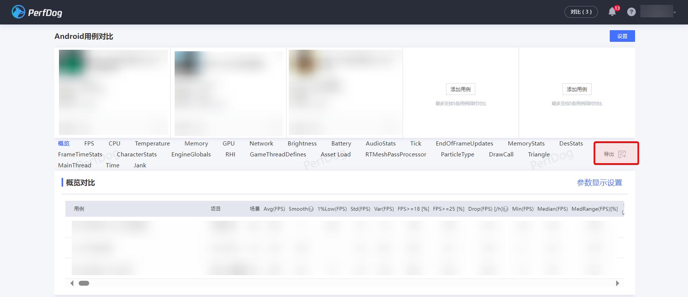
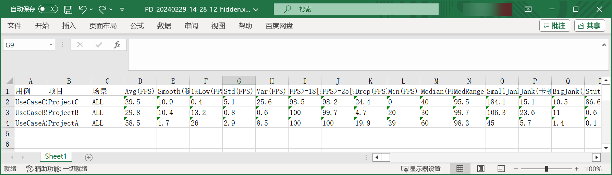

# Perfdog Better Compare

A Python script that generates a better comparison view from [PerfDog](https://perfdog.qq.com/) exported Excel files.

## What does this do

Let's say you are comparing multiple test cases in PerfDog. After exporting the compare result,



PerfDog generates this raw Excel file,



This script improves it by generating a single **CombinedCompare** sheet that:

1. Shows each test case's raw metric values with **data bar** visualization
2. Shows each test case's **÷ Target percentage** with **heatmap coloring** side-by-side
   - 🔴 Red = high ratio (much larger than target)
   - ⬜ Gray = ~100% (within ±10%, smooth gradient)
   - 🔵 Blue = low ratio (much smaller than target)
3. Automatically picks the first test case (by original Excel row order) as the compare target
4. Sorts metrics by ratio descending — highest-deviation metrics appear first
5. Supports normalization by framerate and/or resolution
6. Output filename includes a timestamp to avoid overwriting previous results

## Usage

```
python perfdog_export_better_compare.py [input_file]
       [-h]
       [-i INPUT_DATA_LIST ...]
       [-o OUTPUT_XLSX]
       [-c INPUT_PERFDOG_CONFIG]
       [-f]
       [-r]
       [-C COMPARE_TARGET_COLUMN_NAME]
       [-t COMPARE_TARGET_NAME]
       [-s SHOW_ONLY_COLUMNS_IN_CONFIG]
       [-n / --no_sort_vs]
```

| Short | Long | Default | Description |
|-------|------|---------|-------------|
| | `input_file` | | Single input xlsx (positional) |
| `-i` | `--input_data_list` | | Multiple input xlsx files; stats are averaged per test case |
| `-o` | `--output_xlsx` | `<input>_better_compare_<timestamp>.xlsx` | Output file path |
| `-c` | `--input_perfdog_config` | `perfdog_export_better_compare_config.json` | Config JSON path |
| `-f` | `--divided_by_framerate` | `False` | Normalize selected columns by framerate |
| `-r` | `--divided_by_resolution` | `False` | Normalize selected columns by resolution |
| `-C` | `--compare_target_column_name` | `用例` | Column to use as test case identifier |
| `-t` | `--compare_target_name` | *(first row)* | Target test case name for percentage comparison |
| `-s` | `--show_only_columns_in_config` | `False` | Only show columns listed in config JSON |
| `-n` | `--no_sort_vs` | | Disable descending sort by ratio in the combined sheet |

### Examples

#### Default mode — just pass the file

```bash
python perfdog_export_better_compare.py ./PD_20240229_14_28_12.xlsx
```

The first test case (by original Excel row order) is automatically used as the compare target.

#### Specify compare target explicitly

```bash
python perfdog_export_better_compare.py ./PD_20240229_14_28_12.xlsx -t "用例列的某一单元格的值"
```

#### Compare by project instead of test case

```bash
python perfdog_export_better_compare.py ./PD_20240229_14_28_12.xlsx -C 项目 -t "项目列的某一单元格的值"
```

#### Normalization by framerate

```bash
python perfdog_export_better_compare.py ./PD_20240229_14_28_12.xlsx -f
```

#### Normalization by framerate and resolution

```bash
python perfdog_export_better_compare.py ./PD_20240229_14_28_12.xlsx -f -r
```

#### Multiple input files (averaged)

If you run the same test case multiple times and get multiple exported xlsx files, pass them all — the script groups by test case and **averages** the numeric columns:

```bash
python perfdog_export_better_compare.py -i ./PD_20240229_14_28_12.xlsx ./PD_20240229_14_42_57.xlsx
```

## Output sheet structure

The output xlsx contains:

| Sheet | Description |
|-------|-------------|
| `CombinedCompare` | Main sheet: metrics as rows, each test case has a raw-value column + a ÷Target% column |
| `CompareSource0` | Raw data from first input file (unmodified) |
| `CompareSource1` | Raw data from second input file (if provided), etc. |

### CombinedCompare column layout

```
Metric | [TARGET] raw | [TARGET] % | CaseA raw | CaseA ÷ TARGET % | CaseB raw | CaseB ÷ TARGET % | ...
```

- **Raw columns** (width 18): original metric values with gray data bar
- **% columns** (width 22): ratio = CaseX / TARGET, formatted as percentage with heatmap fill
- **Frozen**: column A (metric names) + first 3 rows (用例 / 项目 / 场景)
- **Top-right info cell**: generation command and timestamp

## Configuration

Edit `perfdog_export_better_compare_config.json` to customize:

- `test_case_column` / `project_column`: column names for test case and project
- `average_framerate_column`: FPS column name
- `forzen_column_num`: number of header rows to freeze (default 3)
- `columns_always_shown`: columns always included when `--show_only_columns_in_config` is set
- `columns_divide_by_framerate`: columns normalized when `-f` is used
- `columns_divide_by_resolution`: columns normalized when `-r` is used
- `columns_divide_by_framerate_and_resolution`: columns normalized when both `-f -r` are used
- `columns_important_background`: columns highlighted with pink background
